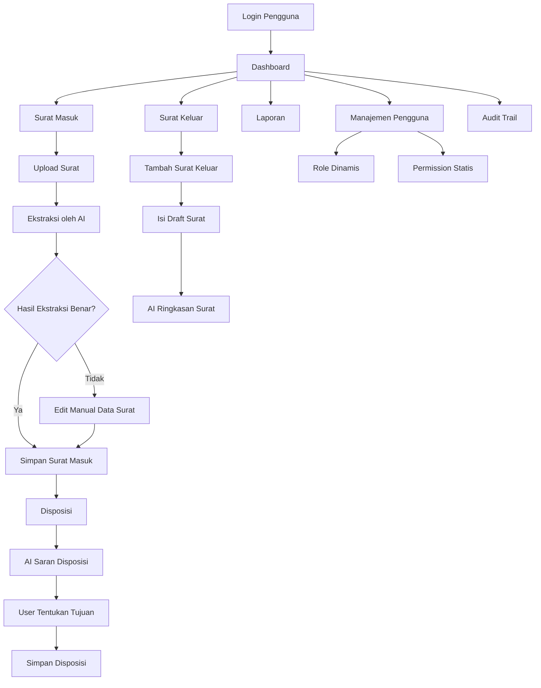
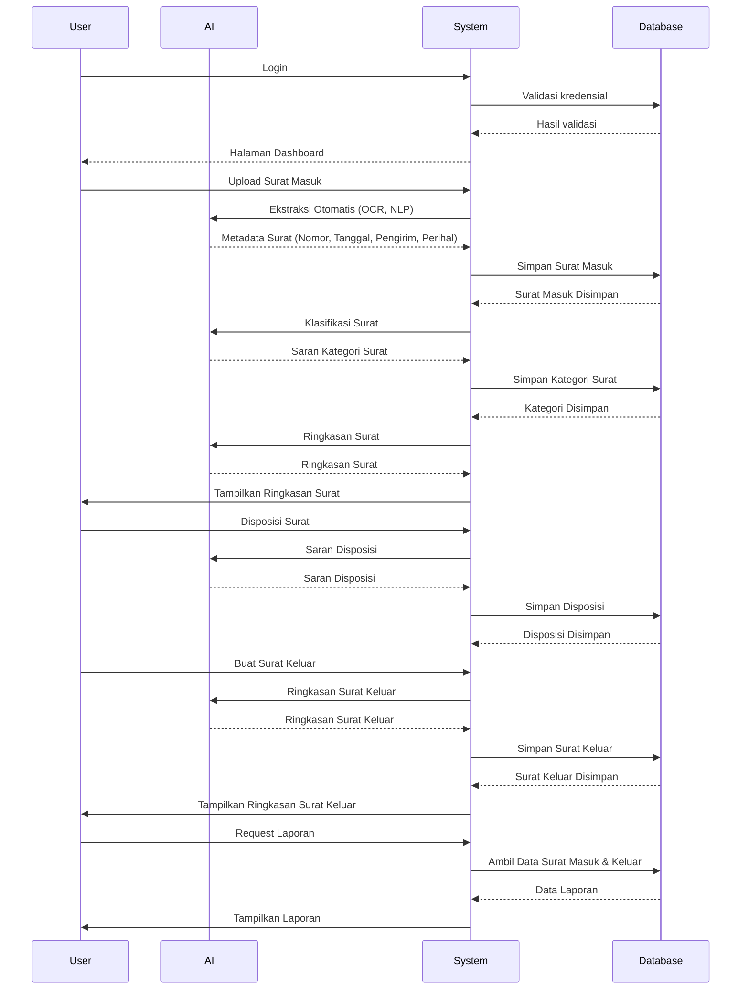

# Alur Aplikasi

```mermaid
flowchart TD
    A[Login Pengguna] --> B[Dashboard]
    B --> C[Surat Masuk]
    C --> C1[Upload Surat]
    C1 --> C2[Ekstraksi oleh AI]
    C2 --> C3{Hasil Ekstraksi Benar?}
    C3 -- Ya --> C4[Simpan Surat Masuk]
    C3 -- Tidak --> C5[Edit Manual Data Surat]
    C5 --> C4

    C4 --> D[Disposisi]
    D --> D1[AI Saran Disposisi]
    D1 --> D2[User Tentukan Tujuan]
    D2 --> D3[Simpan Disposisi]

    B --> E[Surat Keluar]
    E --> E1[Tambah Surat Keluar]
    E1 --> E2[Isi Draft Surat]
    E2 --> E3[AI Ringkasan Surat]

    B --> F[Laporan]
    B --> G[Manajemen Pengguna]
    G --> G1[Role Dinamis]
    G --> G2[Permission Statis]

    B --> H[Audit Trail]
```
## Sequence Flow

```mermaid
sequenceDiagram
    participant User
    participant AI
    participant System
    participant Database

    User->>System: Login
    System->>Database: Validasi kredensial
    Database-->>System: Hasil validasi
    System-->>User: Halaman Dashboard

    User->>System: Upload Surat Masuk
    System->>AI: Ekstraksi Otomatis (OCR, NLP)
    AI-->>System: Metadata Surat (Nomor, Tanggal, Pengirim, Perihal)
    System->>Database: Simpan Surat Masuk
    Database-->>System: Surat Masuk Disimpan

    System->>AI: Klasifikasi Surat
    AI-->>System: Saran Kategori Surat
    System->>Database: Simpan Kategori Surat
    Database-->>System: Kategori Disimpan

    System->>AI: Ringkasan Surat
    AI-->>System: Ringkasan Surat
    System->>User: Tampilkan Ringkasan Surat

    User->>System: Disposisi Surat
    System->>AI: Saran Disposisi
    AI-->>System: Saran Disposisi
    System->>Database: Simpan Disposisi
    Database-->>System: Disposisi Disimpan

    User->>System: Buat Surat Keluar
    System->>AI: Ringkasan Surat Keluar
    AI-->>System: Ringkasan Surat Keluar
    System->>Database: Simpan Surat Keluar
    Database-->>System: Surat Keluar Disimpan
    System->>User: Tampilkan Ringkasan Surat Keluar

    User->>System: Request Laporan
    System->>Database: Ambil Data Surat Masuk & Keluar
    Database-->>System: Data Laporan
    System->>User: Tampilkan Laporan
```
