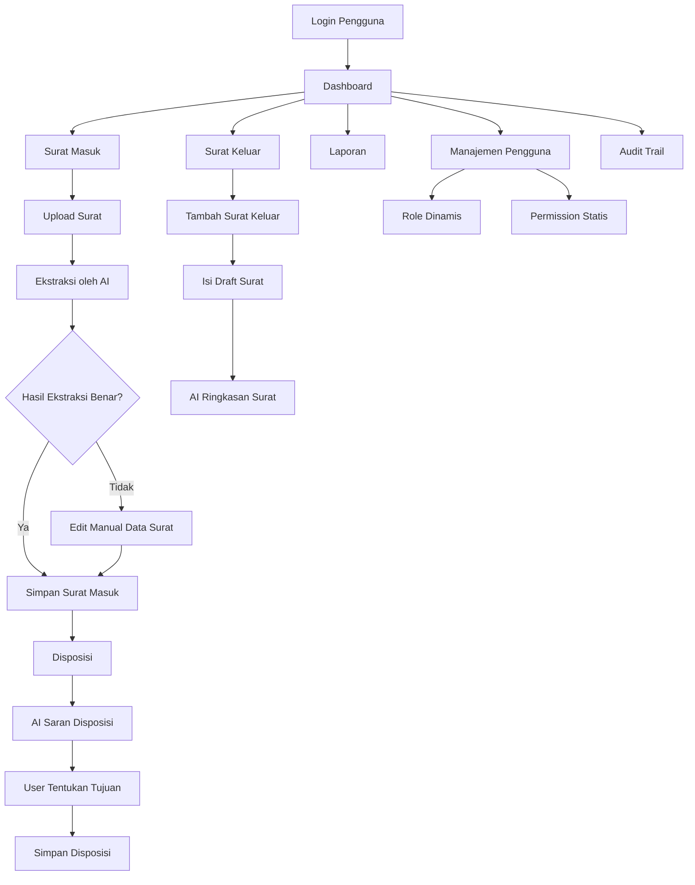

# Alur Aplikasi

```mermaid
flowchart TD
    A[Login Pengguna] --> B[Dashboard]
    B --> C[Surat Masuk]
    C --> C1[Upload Surat]
    C1 --> C2[Ekstraksi oleh AI]
    C2 --> C3{Hasil Ekstraksi Benar?}
    C3 -- Ya --> C4[Simpan Surat Masuk]
    C3 -- Tidak --> C5[Edit Manual Data Surat]
    C5 --> C4

    C4 --> D[Disposisi]
    D --> D1[AI Saran Disposisi]
    D1 --> D2[User Tentukan Tujuan]
    D2 --> D3[Simpan Disposisi]

    B --> E[Surat Keluar]
    E --> E1[Tambah Surat Keluar]
    E1 --> E2[Isi Draft Surat]
    E2 --> E3[AI Ringkasan Surat]

    B --> F[Laporan]
    B --> G[Manajemen Pengguna]
    G --> G1[Role Dinamis]
    G --> G2[Permission Statis]

    B --> H[Audit Trail]
```
