# Alur Aplikasi

## Sequence Flow

### Penjelasan:
- **User** melakukan login ke aplikasi dan mengakses halaman **Dashboard** setelah kredensial tervalidasi.
- **User** mengunggah **Surat Masuk**, yang diproses oleh **AI** untuk ekstraksi metadata, klasifikasi, dan ringkasan surat.
- **System** menyimpan data surat dan kategori ke dalam **Database**.
- **User** dapat melakukan disposisi surat, dengan bantuan **AI** yang memberikan saran disposisi.
- **User** dapat membuat **Surat Keluar**, yang juga akan diproses oleh **AI** untuk menghasilkan ringkasan surat.
- **User** dapat meminta laporan terkait surat masuk dan keluar, yang akan diambil dari **Database** dan ditampilkan oleh **System**.

# Database

## Daftar Tabel

| Tabel | Deskripsi |
|------|-----------|
| `users` | Data user aplikasi |
| `sessions` | Informasi sesi login |
| `roles`, `permissions` | Hak akses |
| `model_has_roles`, `role_has_permissions` | Pivot untuk akses |
| `incoming_letters` | Surat masuk |
| `outgoing_letters` | Surat keluar |
| `letter_categories` | Kategori surat |
| `incoming_letter_user` | Relasi user dan surat masuk (baca) |
| `incoming_letter_category` | Pivot surat masuk & kategori |
| `outgoing_letter_category` | Pivot surat keluar & kategori |
| `dispositions` | Data disposisi surat |

## ERD

```mermaid
erDiagram
    users {
        BIGINT id PK
        STRING name
        STRING email
        TIMESTAMP email_verified_at
        STRING password
        ENUM locale
        STRING remember_token
        TIMESTAMP created_at
        TIMESTAMP updated_at
    }
    password_reset_tokens {
        STRING email PK
        STRING token
        TIMESTAMP created_at
    }
    sessions {
        STRING id PK
        BIGINT user_id FK
        STRING ip_address
        TEXT user_agent
        LONGTEXT payload
        INTEGER last_activity
    }

    permissions {
        BIGINT id PK
        STRING name
        STRING guard_name
        TIMESTAMP created_at
        TIMESTAMP updated_at
    }

    roles {
        BIGINT id PK
        STRING name
        STRING guard_name
        TIMESTAMP created_at
        TIMESTAMP updated_at
    }

    model_has_roles {
        BIGINT role_id FK
        STRING model_type
        BIGINT model_id
    }

    role_has_permissions {
        BIGINT permission_id FK
        BIGINT role_id FK
    }

    incoming_letters {
        UUID id PK
        STRING letter_number
        STRING agenda_number
        DATE letter_date
        STRING sender
        STRING institution
        STRING subject
        LONGTEXT body
        LONGTEXT summary
        BOOLEAN is_draft
        STRING file
        BIGINT created_by FK
        TIMESTAMP created_at
        TIMESTAMP updated_at
    }

    incoming_letter_user {
        UUID incoming_letter_id FK
        BIGINT user_id FK
        TIMESTAMP read_at
        TIMESTAMP created_at
        TIMESTAMP updated_at
    }

    letter_categories {
        BIGINT id PK
        STRING code
        STRING name
        STRING description
        TIMESTAMP created_at
        TIMESTAMP updated_at
    }

    incoming_letter_category {
        BIGINT id PK
        UUID incoming_letter_id FK
        BIGINT letter_category_id FK
        TIMESTAMP created_at
        TIMESTAMP updated_at
    }

    dispositions {
        UUID id PK
        UUID parent_id FK
        UUID incoming_letter_id FK
        BIGINT assignee_id FK
        BIGINT assigner_id FK
        LONGTEXT description
        BOOLEAN is_done
        TIMESTAMP done_at
        BOOLEAN reply_letter
        TIMESTAMP due_at
        TIMESTAMP created_at
        TIMESTAMP updated_at
    }

    outgoing_letters {
        UUID id PK
        STRING letter_number
        STRING agenda_number
        DATE letter_date
        STRING recipient
        STRING subject
        LONGTEXT body
        LONGTEXT summary
        BOOLEAN is_draft
        STRING file
        BIGINT created_by FK
        UUID disposition_id FK
        UUID incoming_letter_id FK
        TIMESTAMP created_at
        TIMESTAMP updated_at
    }

    outgoing_letter_category {
        BIGINT id PK
        UUID outgoing_letter_id FK
        BIGINT letter_category_id FK
        TIMESTAMP created_at
        TIMESTAMP updated_at
    }

    %% Relationships
    users ||--o{ sessions : has
    users ||--o{ incoming_letters : created_by
    users ||--o{ incoming_letter_user : reads
    users ||--o{ dispositions : assigner
    users ||--o{ dispositions : assignee
    users ||--o{ outgoing_letters : creates

    roles ||--o{ model_has_roles : has
    permissions ||--o{ role_has_permissions : has
    roles ||--o{ role_has_permissions : has

    incoming_letters ||--o{ incoming_letter_user : distributed_to
    incoming_letters ||--o{ incoming_letter_category : categorized_as
    letter_categories ||--o{ incoming_letter_category : includes

    incoming_letters ||--o{ dispositions : referenced_in
    dispositions ||--o{ dispositions : parent_of
    dispositions ||--o{ outgoing_letters : leads_to

    outgoing_letters ||--o{ outgoing_letter_category : categorized_as
    letter_categories ||--o{ outgoing_letter_category : includes
```

* Relasi `many-to-many` diatur dengan tabel pivot seperti:

    * `incoming_letter_user`
    * `incoming_letter_category`
    * `outgoing_letter_category`
    * `model_has_roles`
    * `role_has_permissions`
* Relasi `self-referencing` pada `dispositions` (parent\_id).
* Semua UUID ditandai, dan kolom `created_by`, `assigner_id`, `assignee_id`, dan lainnya mengikuti relasi dengan tabel `users`.
