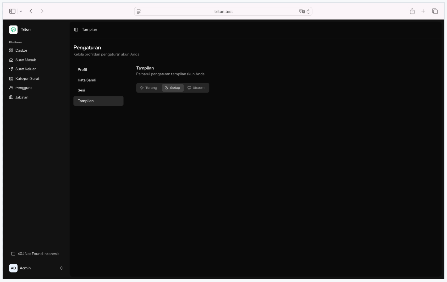

### Daftar Isi
- [Home](#home)
    - [Login](#login)
    - [Lupa Password](#lupa-password)
- [Dasbor](#dasbor)
    - [Ringkasan](#ringkasan)
    - [Performa](#performa)
    - [Grafik Harian](#grafik-harian)
- [Surat Masuk](#surat-masuk)
    - [Filter Surat Masuk](#filter-surat-masuk)
    - [Surat Masuk Baru](#surat-masuk-baru)
    - [Aksi Surat Masuk](#aksi-surat-masuk)
    - [Detail Surat Masuk](#detail-surat-masuk)
    - [Disposisi](#disposisi)
- [Surat Keluar](#surat-keluar)
    - [Filter Surat Keluar](#filter-surat-keluar)
    - [Surat Keluar Baru](#surat-keluar-baru)
    - [Aksi Surat Keluar](#aksi-surat-keluar)
    - [Detail Surat Keluar](#detail-surat-keluar)
- [Kategori Surat](#kategori-surat)
- [Manajemen Pengguna](#pengguna)
- [Jabatan](#jabatan)
- [Pengaturan](#pengaturan)
    - [Profil](#profil)
    - [Kata Sandi](#kata-sandi)
    - [Sesi](#sesi)
    - [Tampilan](#tampilan)

## Home

Jika Anda tertarik dengan produk kami yang lain bisa kunjungi GitHub kami atau kontak langsung via email di [404nf.oa@gmail.com](mailto:404nf.oa@gmail.com).

### Login

Diisi dengan email dan password Anda, Anda bisa menggunakan [akun bawaan](./installation.md#login).

Jika _Remember me_ ditandai maka browser akan mengingat sesi login Anda.

### Lupa Password

Jika Anda lupa password silakan isi email Anda nanti akan ada email masuk yang berisikan link untuk reset password.

## Dasbor

Ini adalah panel utama dan merupakan kesimpulan dari apa yang terjadi di aplikasi Anda.

Secara garis besar ada tiga bagian pada halaman dasbor ini:
- **Ringkasan**: ringkasan dari isi aplikasi, sepanjang waktu
- **Performa**: difilter berdasarkan bulan
- **Grafik Harian**: difiliter berdasarkan bulan

Di bawah ringkasan terdapat filter bulan yang digunakan untuk memilih bulan yang ditampilkan pada **Performa** dan **Grafik Harian**.

### Ringkasan

Di bagian ini ada 4 ringkasan:
- **Surat Masuk**
- **Surat Keluar**
- **Belum Diproses**: Surat masuk yang belum mempunyai disposisi
- **Perlu Diproses**: Disposisi yang harus dibuatkan surat balasannya

### Performa

Di bagian ini ada 3:
- **Rata-rata waktu proses**
- **Ketepatan waktu disposisi**
- **Konversi disposisi ke surat keluar**

### Grafik Harian

atau **Statistik** menggambarkan transaksi harian antara Surat Masuk, Surat Keluar, dan Disposisi pada sistem.

## Surat Masuk

Panel surat masuk berisikan data surat masuk yang diurutkan berdasarkan surat terbaru yang disimpan ke dalam aplikasi.

Secara berurutan data yang ditampilkan pada setiap baris adalah berikut:
- **Nomor Agenda**: penomoran unik pada setiap surat yang tersusun atas kode (`M`), nomor urut surat, bulan dalam romawi, dan tahun.
- **Pengirim**
- **Perihal dan Isi**
- **Waktu Disimpan**: waktu menunjukkan kapan surat diterima atau disimpan ke dalam aplikasi

Surat yang **belum dibaca** ditunjukkan dengan **cetak tebal** sedangkan surat yang **sudah dibaca** ditunjukkan dengan **warna baris yang agak gelap**. 

Di sebelah kiri **Nomor Agenda** terkadang akan muncul ikon indikator.
- Ikon komentar mengindikasikan bahwa surat sudah memiliki disposisi.
    
- Ikon pesawat kertas mengindikasikan bahwa surat sudah dibalas
    

### Filter Surat Masuk

Anda bisa menyaring surat masuk yang ingin ditampilkan.

Selain itu juga hasil penyaringan tersebut bisa diekspor ke file `csv` yang dapat dibuka baik di Excel maupun Google Spreadsheet. File tersebut akan dikirimkan melalui email.

### Surat Masuk Baru

Ketika ingin membuat surat masuk baru Anda harus mengunggah file (pdf atau gambar) dari surat tersebut sebagai arsip.

Setelah file diunggah Anda akan diperlihatkan file surat beserta form inputan dari surat yang bisa Anda isi secara manual. 

Opsi lain Anda bisa menggunakan AI✨ untuk **mengisikan datanya**  sekaligus memberikan **rangkuman surat** beserta rekomendasi untuk **kategori surat**.

Di form tersebut tidak ada **Nomor Agenda**, karena akan dibuatkan secara otomatis oleh sistem dan bersifat internal.

### Aksi Surat Masuk

Jika Anda mengarahkan pointer atau cursor ke baris surat maka **Waktu Disimpan** akan menampilkan aksi yang bisa dilakukan terhadap surat.

Aksi **Unduh** digunakan untuk mengunduh berkas surat masuk.

Aksi **Edit** digunakan untuk mengedit berkas.

Aksi **Tandai Belum Dibaca** hanya dapat dilakukan pada surat yang sudah dibaca.

Aksi **Hapus** digunakan untuk menghapus surat.

Selain empat aksi di atas, Anda juga bisa melakukan _bulk action_ dengan menandai surat.

_Bulk action_ hanya akan muncul ketika ada surat yang dipilih.

### Detail Surat Masuk

Ketika Anda membuka surat masuk, akan seperti ini tampilannya.

Jika surat masuk sudah dibalas, maka di bagian bawah akan ada nomor agenda surat keluar yang berkaitan.

### Disposisi

Untuk membuat disposisi surat, Anda bisa klik tombol disposisi yang ada di kanan atas layar.

Anda dapat menugaskan pengguna lain untuk mengerjakan disposisi. Jika disposisi memerlukan surat balasan, maka Anda dapat menetapkan tenggat waktunya.

Anda juga dapat meminta rekomendasi oleh AI✨ perlu diapakan surat ini.

Pengguna yang ditugaskan akan menerima email penugasan disposisi.

Setelah disposisi berhasil dibuat, semua disposisi akan ditampilkan di bagian bawah surat masuk.

Satu surat bisa memiliki banyak disposisi dan satu disposisi juga bisa memiliki disposisi terusan. 

Di bagian atas disposisi ada pengguna yang memberi disposisi dan yang ditugaskan untuk mengurus disposisi. Nama yang diberi warna hijau terang adalah akun pengguna yang sedang login. Jika tidak ada yang ditugaskan atas disposisi, maka hanya nama pengguna yang membuat disposisi yang akan tampil.

Di bagian pojok kanan bawah ada indikasi penyelesaian disposisi. Disposisi yang telah selesai akan berwarna hijau dan jika ada surat keluar berdasarkan disposisi tersebut maka di sebelahnya akan tampil pula nomor agenda surat keluarnya.

Pengguna yang ditugaskan mengurus disposisi bisa membuat surat balasan berdasarkan disposisi bersangkutan.

Alur pembuatan surat balasan sama dengan [pembuatan surat keluar baru](#surat-keluar-baru).

## Surat Keluar
Panel surat keluar berisikan data surat keluar yang diurutkan berdasarkan surat terbaru yang disimpan ke dalam aplikasi.

Secara berurutan data yang ditampilkan pada setiap baris adalah berikut:
- **Nomor Agenda**: penomoran unik pada setiap surat yang tersusun atas kode (`K`), nomor urut surat, bulan dalam romawi, dan tahun.
- **Penerima**
- **Perihal dan Isi**
- **Waktu Disimpan**: waktu menunjukkan kapan surat diunggah atau disimpan ke dalam aplikasi

### Filter Surat Keluar

Anda bisa menyaring surat keluar yang ingin ditampilkan.

Selain itu juga hasil penyaringan tersebut bisa diekspor ke file `csv` yang dapat dibuka baik di Excel maupun Google Spreadsheet. File tersebut akan dikirimkan melalui email.

### Surat Keluar Baru

Ketika ingin membuat surat keluar baru Anda harus mengunggah file (pdf atau gambar) dari surat tersebut sebagai arsip.

Setelah file diunggah Anda akan diperlihatkan file surat beserta form inputan dari surat yang bisa Anda isi secara manual. 

Opsi lain Anda bisa menggunakan AI✨ untuk **mengisikan datanya**  sekaligus memberikan **rangkuman surat** beserta rekomendasi untuk **kategori surat**.

Di form tersebut tidak ada **Nomor Agenda**, karena akan dibuatkan secara otomatis oleh sistem dan bersifat internal.

### Aksi Surat Keluar

Jika Anda mengarahkan pointer atau cursor ke baris surat maka **Waktu Disimpan** akan menampilkan aksi yang bisa dilakukan terhadap surat.

Aksi **Unduh** digunakan untuk mengunduh berkas surat keluar.

Aksi **Edit** digunakan untuk mengedit berkas.

Aksi **Hapus** digunakan untuk menghapus surat.

Selain empat aksi di atas, Anda juga bisa melakukan _bulk action_ dengan menandai surat.

_Bulk action_ hanya akan muncul ketika ada surat yang dipilih.

### Detail Surat Keluar

Ketika Anda membuka surat keluar, akan seperti ini tampilannya.

Jika surat keluar merupakan surat balasan atau surat tindakan atas disposisi maka tampilannya akan seperti ini.

## Kategori Surat

Anda bisa mengelompokkan surat-surat dan pengelompokkan tersebut Anda buat di sini.

Di halaman ini disediakan fitur [CRUD](https://en.wikipedia.org/wiki/Create,_read,_update_and_delete) agar Anda mudah mengelola kategori surat Anda.

Anda dapat menambahkan kategori baru.

Mengedit kategori yang sudah ada.

Dan juga menghapus kategori surat yang sudah tidak relevan.

Tersedia juga _bulk action_ untuk menghapus kategori surat.

Selain itu, untuk memudahkan pencarian data juga disediakan filter per kolom.

## Pengguna

Halaman ini digunakan untuk mengelola pengguna aplikasi Anda.

Di halaman ini disediakan fitur [CRUD](https://en.wikipedia.org/wiki/Create,_read,_update_and_delete) agar Anda mudah mengelola pengguna di aplikasi Anda.

Anda dapat menambahkan pengguna baru.

Kata sandi yang digunakan untuk masuk ke dalam aplikasi akan dikirim ke pengguna baru melalui email setelah akun pengguna baru dibuat.

Mengedit nama ataupun jabatan dari pengguna juga memungkinkan.

Jika pengguna sudah tidak aktif, maka akunnya juga bisa dihapus.

Untuk memudahkan pencarian data juga disediakan filter per kolom.

## Jabatan

Halaman ini digunakan untuk membuat jabatan/unit/bagian atau apapun Anda menyebutnya beserta hak akses aplikasi. Di halaman ini Anda dapat mengatur jabatan apa yang bisa mengakses fitur apa.

Terdapat beberapa hak akses yang tersedia berdasarkan modulnya, yakni:
- **Pengguna**: `ViewUser`, `AddUser`, `EditUser`, `DeleteUser`
- **Jabatan**:  `ViewRole`, `AddRole`, `EditRole`, `DeleteRole`
- **Surat Masuk**: `ViewIncomingLetter`, `AddIncomingLetter`, `EditIncomingLetter`, `DeleteIncomingLetter`
- **Surat Keluar**: `ViewOutgoingLetter`, `AddOutgoingLetter`, `EditOutgoingLetter`, `DeleteOutgoingLetter`
- **Kategori Surat**: `ViewLetterCategory`, `AddLetterCategory`, `EditLetterCategory`, `DeleteLetterCategory`
- **Disposisi**: `ViewDisposition`, `AddDisposition`, `EditDisposition`, `DeleteDisposition`

Anda dapat menambahkan jabatan baru.

Mengedit jabatan yang ada.

Bahkan menghapusnya.

## Pengaturan

Pengaturan dapat diakses melalui menu yang ada di pojok kiri bawah.

### Profil

Di halaman profil Anda dapat memperbarui nama, email, dan bahasa yang digunakan di aplikasi.

Jika Anda mengganti bahasa, maka seluruh fitur di aplikasi akan menyesuaikan seperti contoh berikut apabila diganti ke bahasa Jepang.

Di halaman ini juga Anda dapat menghapus akun namun **harap berhati-hati dengan fitur ini** karena data akan dihapus permanen.

### Kata Sandi

Di halaman ini Anda dapat memperbarui kata sandi atau password.

### Sesi

Di halaman ini Anda dapat melihat perangkat yang sedang menggunakan akun Anda dan di sini juga Anda dapat melakukan logout dari perangkat lain.

### Tampilan

Di halaman ini Anda dapat mengubah mode tampilan entah menggunakan mode terang, gelap, atau menyesuaikan sistem.

